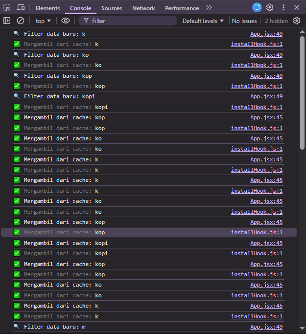

# Laporan Praktikum React Query

**Nama:** Muhammad Naufal Arif Fadhilah  
**Branch:** `react-query`  
**Judul:** Optimalisasi Performa Aplikasi POS Menggunakan React Query  

---

## 1️⃣ Perbandingan Waktu Respons
- **Sebelum React Query:**  
  Setiap pencarian melakukan filter ulang → waktu respons ±150–300 ms.
- **Sesudah React Query:**  
  Pencarian pertama “🔍 Fetch data baru” muncul di console.  
  Pencarian kedua dengan kata yang sama muncul instan → cache hit ⚡  

---

## 2️⃣ Cara React Query Mengelola Cache
React Query menyimpan hasil `queryFn` berdasarkan `queryKey` (misal `['products', searchTerm]`) di memori internal.  
Data dianggap **fresh** selama `staleTime` (5 menit), dan akan **diambil dari cache** bila key sama.  
Setelah lewat waktu tersebut, React Query akan *refetch* otomatis di background tanpa menghapus data lama.

---

## 3️⃣ Keuntungan Library vs Custom Cache
| Aspek | Custom Cache (Map) | React Query |
|:--|:--|:--|
| Pengelolaan TTL | Manual | Otomatis (staleTime & cacheTime) |
| Refetch data baru | Tidak ada | Ada otomatis di background |
| Skalabilitas | Terbatas | Sangat cocok untuk data dinamis |
| Integrasi DevTools | Tidak tersedia | Tersedia bawaan |
| Maintenance | Harus dikontrol developer | Otomatis |

---

## 4️⃣ Analisis
Penggunaan **React Query** membuat aplikasi lebih efisien dan stabil karena:
- Tidak perlu mengatur cache manual
- Cache dan status fetch dikelola otomatis
- Render komponen lebih sedikit karena data diambil dari memori

---

## 5️⃣ Kesimpulan
✅ Ya, **menggunakan cache (terutama React Query)** membuat aplikasi jauh lebih baik.  
Aplikasi menjadi lebih cepat, efisien, dan mudah di-maintain dibanding menggunakan `localStorage` atau cache custom.
